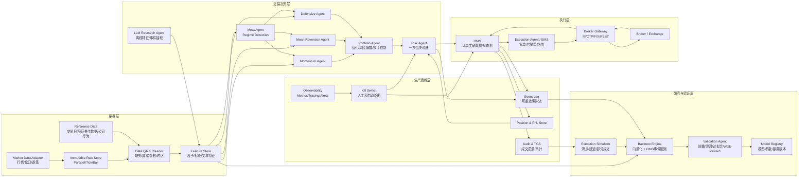
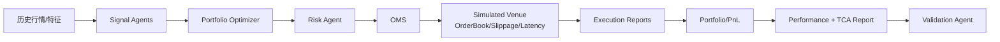

# C++ 量化交易系统架构

基于 Wayland Zhang《AI 量化交易：从 0 到 1》的核心思想整理：系统目标不是追求单个“神奇策略”，而是构建一个可回测、可验证、可交易、可监控、可演化的中频多智能体量化交易系统。

本文档面向 C++20 工程落地。默认场景是日内到周级的中低频交易，不做微秒级 HFT；先以模块化单体启动，模块边界清晰，后续可拆成独立服务。

## 1. 架构原则

1. 数据优先：原始数据不可变、可追溯、可重放；清洗、复权、时区、缺失值、幸存者偏差是系统能力的一部分。
2. 信号和执行分离：策略只能生成信号或目标组合，不能直接下单；真实成交由 OMS/EMS 和执行代理完成。
3. Regime 驱动：市场状态识别是 Meta Agent 的核心能力，用来路由策略和调整权重，但危机检测优先于收益优化。
4. 风控独立：Risk Agent 拥有一票否决权，不能被策略、研究模块、LLM 或人工随意绕过。
5. 组合层必不可少：信号之后必须经过组合构建，显式控制相关性、因子暴露、杠杆和再平衡成本。
6. 成本真实化：回测必须建模佣金、滑点、冲击成本、延迟、部分成交和不成交概率。
7. 生产闭环：每笔订单、每次风控拒绝、每个成交回报都要进入审计日志，用实盘 TCA 数据反向校准执行模拟器。
8. LLM 只做增强层：LLM 可以做文本理解、事件抽取、研究报告和因子假设生成，不能直接生成订单、改仓位或覆盖风控。

## 2. 总体架构



## 3. 进程与线程模型

MVP 阶段使用单进程模块化单体，减少分布式复杂度。

推荐进程：

```text
traderd      实盘主进程：行情、Agent、风控、OMS、执行、监控
backtestd    回测与仿真进程：事件驱动回测、执行模拟、验证报告
ingestd      数据采集进程：历史数据、实时落盘、数据质量检查
riskctl      风控控制台：熔断、降仓、只读审计、人工确认
```

`traderd` 内部线程：

```text
MarketDataThread      行情接入、标准化、时间戳校验
EventLoopThread       核心事件调度，保持确定性顺序
AgentWorkerPool       策略信号与 Regime 计算
RiskThread            同步风控路径，禁止异步绕过
OmsThread             订单状态机、幂等处理、重放恢复
ExecutionThread       券商网关、挂撤单、成交回报
PersistenceThread     事件、订单、仓位、指标异步落盘
WatchdogThread        心跳、延迟、数据缺口、熔断监控
```

关键要求：风控检查和订单发出必须在同一个强制路径上完成，任何策略模块不得持有 Broker Gateway 的写权限。

## 4. C++ 模块划分

```text
quant-system/
  CMakeLists.txt
  cmake/
  configs/
    dev.yaml
    paper.yaml
    prod.yaml
    risk_limits.yaml
  schemas/
    events.fbs
    orders.fbs
    market_data.fbs
  include/qt/
    core/
      time.hpp
      ids.hpp
      event.hpp
      event_bus.hpp
      expected.hpp
    data/
      instrument.hpp
      calendar.hpp
      market_data.hpp
      data_quality.hpp
      feature_store.hpp
    agent/
      agent.hpp
      meta_agent.hpp
      signal_agent.hpp
      llm_feature_agent.hpp
    portfolio/
      optimizer.hpp
      exposure.hpp
      rebalance.hpp
    risk/
      risk_agent.hpp
      risk_rule.hpp
      kill_switch.hpp
      stress_test.hpp
    execution/
      order.hpp
      oms.hpp
      execution_agent.hpp
      broker_gateway.hpp
      normalizer.hpp
    backtest/
      backtest_engine.hpp
      simulated_venue.hpp
      cost_model.hpp
      validation_agent.hpp
    storage/
      event_store.hpp
      snapshot_store.hpp
      parquet_store.hpp
    ops/
      metrics.hpp
      alert.hpp
      audit.hpp
  src/
    core/
    data/
    agent/
    portfolio/
    risk/
    execution/
    backtest/
    storage/
    ops/
  apps/
    traderd/main.cpp
    backtestd/main.cpp
    ingestd/main.cpp
    riskctl/main.cpp
  tests/
    unit/
    integration/
    replay/
```

## 5. 核心事件模型

系统内部一律使用标准化事件，券商、交易所、数据商的私有格式只存在于 Adapter/Gateway 边界。

```cpp
namespace qt {

using EventSeq = std::uint64_t;
using OrderId = std::string;
using StrategyId = std::string;

struct InstrumentId {
    std::string symbol;    // AAPL
    std::string exchange;  // NASDAQ
};

struct MarketTick {
    InstrumentId instrument;
    std::chrono::nanoseconds exchange_ts;
    std::chrono::nanoseconds receive_ts;
    double bid_px{};
    double ask_px{};
    double last_px{};
    double bid_qty{};
    double ask_qty{};
    double last_qty{};
};

struct Bar {
    InstrumentId instrument;
    std::chrono::nanoseconds begin_ts;
    std::chrono::nanoseconds end_ts;
    double open{};
    double high{};
    double low{};
    double close{};
    double volume{};
    bool adjusted{};
};

enum class Regime { Trending, MeanReverting, Crisis, Uncertain };

struct RegimeState {
    Regime regime;
    double confidence{};
    double momentum_weight{};
    double mean_revert_weight{};
    double defensive_weight{};
    std::string model_version;
};

struct Signal {
    StrategyId strategy_id;
    InstrumentId instrument;
    double score{};          // alpha strength
    double confidence{};
    double horizon_seconds{};
    std::string feature_version;
};

struct TargetPosition {
    InstrumentId instrument;
    double target_weight{};
};

struct TargetPortfolio {
    std::vector<TargetPosition> positions;
    double expected_turnover{};
    double expected_cost_bps{};
    std::string optimizer_version;
};

enum class RiskAction { Approve, Reduce, Reject, Liquidate, Halt };

struct RiskDecision {
    RiskAction action;
    std::string reason;
    TargetPortfolio adjusted_portfolio;
};

enum class OrderSide { Buy, Sell };
enum class OrderType { Market, Limit, Stop, AlgoTwap, AlgoVwap };

struct OrderIntent {
    InstrumentId instrument;
    OrderSide side;
    OrderType type;
    double quantity{};
    double limit_price{};
    std::string parent_decision_id;
};

struct ExecutionReport {
    OrderId order_id;
    InstrumentId instrument;
    double filled_qty{};
    double avg_price{};
    double commission{};
    double slippage_bps{};
    std::chrono::nanoseconds broker_ts;
    std::string broker_status;
};

} // namespace qt
```

## 6. 核心接口

### 6.1 Agent 接口

```cpp
class IAgent {
public:
    virtual ~IAgent() = default;
    virtual std::string_view name() const noexcept = 0;
    virtual void on_market_event(const qt::MarketTick& tick) = 0;
    virtual void on_bar(const qt::Bar& bar) = 0;
};

class ISignalAgent : public IAgent {
public:
    virtual std::vector<qt::Signal> generate_signals(
        const FeatureFrame& features,
        const PortfolioSnapshot& portfolio,
        const qt::RegimeState& regime) = 0;
};

class IMetaAgent : public IAgent {
public:
    virtual qt::RegimeState detect_regime(const FeatureFrame& features) = 0;
};
```

### 6.2 组合优化接口

```cpp
class IPortfolioOptimizer {
public:
    virtual ~IPortfolioOptimizer() = default;

    virtual qt::TargetPortfolio optimize(
        std::span<const qt::Signal> signals,
        const PortfolioSnapshot& current,
        const ExposureMatrix& exposures,
        const CostSurface& costs,
        const qt::RegimeState& regime) = 0;
};
```

组合层必须处理：

1. 单资产权重上限。
2. 行业、风格、国家、币种、Beta 暴露约束。
3. 相关性和危机相关性压力测试。
4. 换手率和交易成本约束。
5. 再平衡阈值，避免 Regime 频繁切换带来的交易损耗。

### 6.3 风控接口

```cpp
class IRiskRule {
public:
    virtual ~IRiskRule() = default;

    virtual std::optional<std::string> check(
        const qt::TargetPortfolio& target,
        const PortfolioSnapshot& current,
        const MarketState& market,
        const AccountState& account) const = 0;
};

class RiskAgent {
public:
    qt::RiskDecision review(
        const qt::TargetPortfolio& target,
        const PortfolioSnapshot& current,
        const MarketState& market,
        const AccountState& account);

private:
    std::vector<std::unique_ptr<IRiskRule>> rules_;
};
```

必备风控规则：

```text
PositionLimitRule       单标的、单行业、单策略仓位上限
LeverageLimitRule       总杠杆、融资融券、保证金缓冲
DrawdownCircuitRule     日内/周/月/总回撤熔断
VolatilityScaleRule     高波动自动降仓
LiquidityRule           ADV 占比、盘口深度、最小成交概率
CorrelationShockRule    危机相关性趋近 1 的压力测试
ConcentrationRule       防止“十只科技股”的伪分散
StaleDataRule           禁止用陈旧行情生成订单
HumanOverrideRule       人工干预必须审计，不能覆盖硬限制
```

### 6.4 执行接口

```cpp
class IBrokerGateway {
public:
    virtual ~IBrokerGateway() = default;

    virtual BrokerOrderId submit(const qt::OrderIntent& order) = 0;
    virtual void cancel(const BrokerOrderId& order_id) = 0;
    virtual std::vector<qt::ExecutionReport> poll_reports() = 0;
    virtual BrokerHealth health() const = 0;
};

class IExecutionAlgo {
public:
    virtual ~IExecutionAlgo() = default;

    virtual std::vector<qt::OrderIntent> plan(
        const qt::RiskDecision& decision,
        const PortfolioSnapshot& current,
        const OrderBookSnapshot& book,
        const CostSurface& costs) = 0;
};
```

执行层职责：

1. 将目标组合转换为订单意图。
2. 拆单、限价、追价、撤单和重挂。
3. 处理部分成交、拒单、超时和券商断线。
4. 记录完整订单生命周期，给回测模拟器做校准。
5. 维护内部统一代码 `SYMBOL.EXCHANGE`，在边界处映射券商代码。

## 7. 数据层设计

### 7.1 存储分层

```text
raw_store/
  provider=polygon/
    asset=equity/
      date=2026-04-20/
        AAPL.NASDAQ.tick.parquet

clean_store/
  asset=equity/
    freq=1m/
      date=2026-04-20/
        AAPL.NASDAQ.bar.parquet

feature_store/
  feature_set=core_v3/
    date=2026-04-20/
      features.parquet

order_store/
  orders
  fills
  positions
  risk_decisions
  tca_reports
```

### 7.2 数据质量检查

```text
SchemaCheck             字段名、类型、单位统一
TimestampCheck          交易所时间、接收时间、时区标准化
GapCheck                缺失 Tick/Bar、交易时段断点
OutlierCheck            异常价格、异常成交量、跳价
CorporateActionCheck    拆股、分红、合股、换代码
SurvivorshipCheck       回测股票池必须使用历史成分和退市数据
StaleQuoteCheck         禁止用休市或过期报价下单
CrossSourceCheck        多数据源交叉验证关键字段
```

原始数据永不修改。任何清洗、复权、补齐都生成新版本，并记录处理版本、输入版本、代码 commit 和配置 hash。

## 8. 回测架构

回测必须分两层：

1. 快速向量化回测：验证信号逻辑、因子方向、样本外表现。
2. OMS 集成回测：模拟订单生命周期、滑点、冲击成本、延迟、部分成交和拒单。



Validation Agent 检查：

```text
Look-ahead Bias         信号时间必须早于可交易时间
Data Leakage            训练/验证/测试按时间切分，禁止全局归一化泄漏
Overfitting             参数搜索惩罚、样本外表现阈值
Walk-forward            滚动训练和滚动测试
Cost Sensitivity        成本加倍后是否仍可交易
Capacity                ADV、盘口深度、市场冲击
Regime Robustness       趋势、震荡、危机分别评估
Kill-switch Drill       故意触发熔断，验证风控生效
```

## 9. 实盘交易流

```text
1. MarketDataAdapter 接收行情，标准化为 MarketTick / Bar。
2. DataQualityGuard 检查延迟、缺失、异常和交易时段。
3. FeatureEngine 更新特征快照。
4. MetaAgent 输出 RegimeState，危机状态优先。
5. 多个 SignalAgent 并行生成信号。
6. PortfolioAgent 合成目标组合，考虑暴露、相关性、成本和换手。
7. RiskAgent 审核目标组合，必要时降仓、拒绝或触发熔断。
8. OMS 将批准后的目标组合转成订单状态机。
9. ExecutionAgent 按盘口和成本模型拆单、挂单、撤单、追价。
10. BrokerGateway 发送订单并接收成交回报。
11. PositionStore 更新仓位、现金、PnL。
12. Audit/TCA 记录滑点、延迟、成交率，用于校准模拟器。
```

## 10. Regime 与策略路由

MVP 可以先使用规则法，后续引入 HMM 或 ML 模型。

```cpp
class RuleBasedRegimeAgent final : public IMetaAgent {
public:
    qt::RegimeState detect_regime(const FeatureFrame& f) override {
        const double vol = f.scalar("market.realized_vol_20d");
        const double corr = f.scalar("market.avg_corr_20d");
        const double adx = f.scalar("market.adx_20d");
        const double ret = f.scalar("market.ret_20d");

        if (vol > 0.30 && corr > 0.80) {
            return {qt::Regime::Crisis, 0.80, 0.10, 0.10, 0.80, "rule_v1"};
        }
        if (adx > 25.0 && std::abs(ret) > 0.05 && vol < 0.30) {
            return {qt::Regime::Trending, 0.70, 0.70, 0.20, 0.10, "rule_v1"};
        }
        if (adx < 20.0 && vol < 0.20) {
            return {qt::Regime::MeanReverting, 0.60, 0.20, 0.70, 0.10, "rule_v1"};
        }
        return {qt::Regime::Uncertain, 0.30, 0.33, 0.33, 0.34, "rule_v1"};
    }
};
```

路由原则：

```text
Trending        提高 Momentum Agent 权重，降低均值回归权重
MeanReverting   提高 Mean Reversion Agent 权重，控制追涨策略
Crisis          防御策略和降仓优先，不等待完美确认
Uncertain       降低总风险预算，软切换而非硬切换
```

## 11. LLM 在系统中的位置

LLM 模块只能存在于研究和特征生产路径：

```text
允许：
  财报/新闻/公告解析
  事件标签抽取
  情绪和风险评分
  策略复盘报告
  因子假设生成

禁止：
  直接下单
  直接给目标仓位
  修改风控参数
  覆盖止损和熔断
  进入低延迟执行路径
```

LLM 输出必须数值化、版本化、可回放，并和其他特征一样经过回测、漂移监控和样本外验证。

## 12. 生产运维

### 12.1 关键指标

```text
数据指标：
  market_data_lag_ms
  missing_bar_ratio
  stale_quote_count
  cross_source_price_diff_bps

策略指标：
  signal_count
  signal_decay
  regime_switch_count
  turnover
  live_vs_backtest_pnl_gap

风控指标：
  rejected_order_count
  leverage
  gross_exposure
  net_exposure
  drawdown
  factor_exposure

执行指标：
  order_ack_latency_ms
  fill_rate
  partial_fill_rate
  slippage_bps
  cancel_reject_count

系统指标：
  event_loop_lag_ms
  queue_depth
  broker_connection_state
  persistence_lag_ms
```

### 12.2 熔断策略

```text
Level 1 Warning      数据延迟、滑点异常、轻微回撤，通知但不停止
Level 2 Reduce       波动率或相关性异常，自动降低目标风险
Level 3 HaltNew      禁止新开仓，只允许减仓和平仓
Level 4 Liquidate    系统性风险，按预案清仓
Level 5 ManualOnly   券商/数据/程序异常，进入人工确认模式
```

### 12.3 发布门禁

```text
Unit Tests                100% 通过
Replay Tests              固定历史事件重放结果一致
Vector Backtest Gate      信号层指标达标
OMS Backtest Gate         成本、滑点、部分成交后仍达标
Risk Drill                熔断和拒单路径可触发
Paper Trading             至少运行 N 个交易日无严重告警
Micro Live                1%-5% 资金采集真实成交数据
Scale-up Review           TCA 与回测模拟误差在阈值内
```

## 13. 技术选型

```text
C++ 标准         C++20
构建             CMake + vcpkg/Conan
日志             spdlog + fmt
配置             yaml-cpp
序列化           FlatBuffers / Protocol Buffers
表格数据         Apache Arrow + Parquet
本地分析         DuckDB
事件持久化       Kafka/Redpanda/NATS JetStream；MVP 可先用本地 append-only log
订单数据库       PostgreSQL
缓存状态         RocksDB / SQLite / in-memory snapshot
数值计算         Eigen
模型推理         ONNX Runtime
监控             Prometheus + OpenTelemetry + Grafana
测试             GoogleTest + golden replay tests
券商接口         IB TWS API / FIX / CTP / Alpaca REST，统一藏在 BrokerGateway 后
```

## 14. 迭代路线

### Phase 0：研究原型

```text
历史数据采集
数据 QA
基础特征
一个 Momentum Agent
一个 Mean Reversion Agent
快速向量化回测
```

### Phase 1：模块化单体 MVP

```text
EventBus
FeatureStore
MetaAgent 规则版 Regime
PortfolioAgent
RiskAgent
OMS 回测
Execution Simulator
审计日志
```

### Phase 2：模拟盘

```text
BrokerGateway
Paper Trading
真实订单生命周期
Prometheus 指标
Kill Switch
TCA 报告
```

### Phase 3：小资金实盘

```text
1%-5% 资金
全量订单和成交日志
滑点模型校准
日终风险复盘
人工审批扩容
```

### Phase 4：生产化拆分

```text
Data Service
Feature Service
Risk Service
OMS/EMS Service
Backtest Service
Model Registry
Observability Stack
```

## 15. 最小可交付版本

第一版不要做太多。建议只交付这条闭环：

```text
历史日线/分钟线数据
  -> 数据质量检查
  -> 特征计算
  -> Regime 规则识别
  -> 两个策略 Agent
  -> 组合合成
  -> 风控审核
  -> OMS 事件回测
  -> 成本和滑点模拟
  -> 回测报告
  -> Paper Trading
```

完成后再加入 LLM 特征、HMM/ML Regime、复杂组合优化和多券商执行。架构的重点不是第一天就复杂，而是第一天就把边界放对。

## 参考来源

- [AI量化交易：从0到1 总目录](https://www.waylandz.com/quant-book/)
- [第01课：量化交易全景图](https://www.waylandz.com/quant-book/%E7%AC%AC01%E8%AF%BE%EF%BC%9A%E9%87%8F%E5%8C%96%E4%BA%A4%E6%98%93%E5%85%A8%E6%99%AF%E5%9B%BE/)
- [第06课：数据工程的残酷现实](https://www.waylandz.com/quant-book/%E7%AC%AC06%E8%AF%BE%EF%BC%9A%E6%95%B0%E6%8D%AE%E5%B7%A5%E7%A8%8B%E7%9A%84%E6%AE%8B%E9%85%B7%E7%8E%B0%E5%AE%9E/)
- [第07课：回测系统的陷阱](https://www.waylandz.com/quant-book/%E7%AC%AC07%E8%AF%BE%EF%BC%9A%E5%9B%9E%E6%B5%8B%E7%B3%BB%E7%BB%9F%E7%9A%84%E9%99%B7%E9%98%B1/)
- [第10课：从模型到Agent](https://www.waylandz.com/quant-book/%E7%AC%AC10%E8%AF%BE%EF%BC%9A%E4%BB%8E%E6%A8%A1%E5%9E%8B%E5%88%B0Agent/)
- [第12课：市场状态识别](https://www.waylandz.com/quant-book/%E7%AC%AC12%E8%AF%BE%EF%BC%9A%E5%B8%82%E5%9C%BA%E7%8A%B6%E6%80%81%E8%AF%86%E5%88%AB/)
- [第13课：Regime误判与系统性崩溃模式](https://www.waylandz.com/quant-book/%E7%AC%AC13%E8%AF%BE%EF%BC%9ARegime%E8%AF%AF%E5%88%A4%E4%B8%8E%E7%B3%BB%E7%BB%9F%E6%80%A7%E5%B4%A9%E6%BA%83%E6%A8%A1%E5%BC%8F/)
- [第14课：LLM在量化中的应用](https://www.waylandz.com/quant-book/%E7%AC%AC14%E8%AF%BE%EF%BC%9ALLM%E5%9C%A8%E9%87%8F%E5%8C%96%E4%B8%AD%E7%9A%84%E5%BA%94%E7%94%A8/)
- [第15课：风险控制与资金管理](https://www.waylandz.com/quant-book/%E7%AC%AC15%E8%AF%BE%EF%BC%9A%E9%A3%8E%E9%99%A9%E6%8E%A7%E5%88%B6%E4%B8%8E%E8%B5%84%E9%87%91%E7%AE%A1%E7%90%86/)
- [第16课：组合构建与风险暴露管理](https://www.waylandz.com/quant-book/%E7%AC%AC16%E8%AF%BE%EF%BC%9A%E7%BB%84%E5%90%88%E6%9E%84%E5%BB%BA%E4%B8%8E%E9%A3%8E%E9%99%A9%E6%9A%B4%E9%9C%B2%E7%AE%A1%E7%90%86/)
- [第17课：在线学习与策略进化](https://www.waylandz.com/quant-book/%E7%AC%AC17%E8%AF%BE%EF%BC%9A%E5%9C%A8%E7%BA%BF%E5%AD%A6%E4%B9%A0%E4%B8%8E%E7%AD%96%E7%95%A5%E8%BF%9B%E5%8C%96/)
- [第18课：交易成本建模与可交易性](https://www.waylandz.com/quant-book/%E7%AC%AC18%E8%AF%BE%EF%BC%9A%E4%BA%A4%E6%98%93%E6%88%90%E6%9C%AC%E5%BB%BA%E6%A8%A1%E4%B8%8E%E5%8F%AF%E4%BA%A4%E6%98%93%E6%80%A7/)
- [第19课：执行系统 - 从信号到真实成交](https://www.waylandz.com/quant-book/%E7%AC%AC19%E8%AF%BE%EF%BC%9A%E6%89%A7%E8%A1%8C%E7%B3%BB%E7%BB%9F%20-%20%E4%BB%8E%E4%BF%A1%E5%8F%B7%E5%88%B0%E7%9C%9F%E5%AE%9E%E6%88%90%E4%BA%A4/)
- [第20课：生产运维](https://www.waylandz.com/quant-book/%E7%AC%AC20%E8%AF%BE%EF%BC%9A%E7%94%9F%E4%BA%A7%E8%BF%90%E7%BB%B4/)
- [第21课：项目实战](https://www.waylandz.com/quant-book/%E7%AC%AC21%E8%AF%BE%EF%BC%9A%E9%A1%B9%E7%9B%AE%E5%AE%9E%E6%88%98/)
- [附录B：量化系统的12种典型死亡方式](https://www.waylandz.com/quant-book/%E9%99%84%E5%BD%95B%EF%BC%9A%E9%87%8F%E5%8C%96%E7%B3%BB%E7%BB%9F%E7%9A%8412%E7%A7%8D%E5%85%B8%E5%9E%8B%E6%AD%BB%E4%BA%A1%E6%96%B9%E5%BC%8F/)
