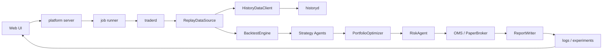
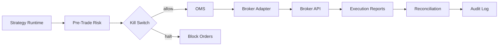

# KaTrade Project Design

本文档定义 KaTrade 从“本地回测样机”演进到“可研究、可验证、可纸面交易、可接近实盘准备”的项目设计。

重要边界：平台不能保证赚钱。平台的目标是把研究、数据、回测、风控、执行、监控做成可复现闭环，降低假收益、过拟合、错误数据、执行滑点和失控订单造成的风险。

## 1. 项目定位

KaTrade 的目标是本地优先的量化研究与交易平台：

- 支持 C++ 核心回测和交易逻辑。
- 支持独立历史数据服务器，可运行在另一台 Mac。
- 支持本地 Web 客户端，用于运行、配置、查看报告和管理策略。
- 支持 Kimi / DeepSeek / Kimi Code 类 Agent 作为研究助手。
- 默认只运行离线回测、paper trading 和 OKX/欧意 simulated trading，不连接真实资金交易通道。

非目标：

- 不承诺策略收益。
- 不在默认配置中执行实盘交易。
- 不把 API key、broker key、个人配置上传到 Git。
- 不让 Agent 默认修改项目文件或发出真实交易动作。

## 2. 设计原则

1. 数据先于策略：没有可验证的数据版本、交易日历、复权和坏点检测，策略收益不可信。

2. 研究与交易分层：策略只输出信号，组合层决定仓位，风控层裁剪，OMS 负责订单生命周期。

3. 回测必须接近真实执行：手续费、滑点、成交量限制、延迟、拒单和限价单都应进入模拟。

4. 所有实验必须可复现：每次回测都保存代码版本、配置、数据版本、策略参数、指标和报告。

5. 实盘能力默认关闭：live trading 必须经过独立配置、权限检查、风控检查和显式开关。

6. 风控不可绕过：任何订单进入 broker 前必须经过 pre-trade risk。

7. 交易后端优先 Modern C++20：除浏览器 UI 和过渡期本地 HTTP 壳层外，策略、风控、执行、订单状态、行情处理和运维门禁都应逐步落到 C++ 模块。

8. 本地隐私优先：API key 和交易凭证只保存在本地 ignored 配置或系统安全存储中。

9. 执行门禁可测试：OKX simulated execution 的现货、cash、limit/post_only、kill switch、名义金额和白名单检查必须有 C++ 可复现检查覆盖，UI/API 不应成为唯一安全边界。

## 3. 总体架构

```text
Data Plane
  historyd
  live_market_data
  reference_data
  calendar
  corporate_actions
  data_quality
  feature_store

Research Plane
  strategy_sdk
  strategy_catalog
  feature_engineering
  experiment_tracker
  parameter_sweep
  walk_forward_validation

Backtest Plane
  event_driven_simulator
  cost_model
  slippage_model
  fill_model
  benchmark_engine
  report_engine

Portfolio / Risk Plane
  portfolio_optimizer
  exposure_limits
  drawdown_control
  pre_trade_risk
  kill_switch
  risk_report

Execution Plane
  OMS
  paper_broker
  broker_adapters
  order_router
  reconciliation
  trade_journal

Platform Plane
  config_service
  job_runner
  scheduler
  artifact_store
  report_service
  agent_service
  auth / secrets

UI Client
  dashboard
  strategy_lab
  experiments
  backtests
  data_quality
  risk_center
  orders
  reports
  agent
```

## 4. 目标运行流

### 4.1 回测流



### 4.2 Paper Trading 流


### 4.3 Live Trading 流

Live trading 在项目早期保持关闭。启用条件：

- broker adapter 已实现。
- pre-trade risk 已覆盖硬限制。
- kill switch 可用。
- paper trading 连续稳定运行。
- 对账差异可解释。
- 用户显式启用 live mode。



## 5. 模块设计

### 5.1 Data Plane

职责：

- 提供历史行情、未来 live 行情、合约元数据、交易日历、复权信息。
- 检测坏点、缺口、重复行、异常价格、异常成交量。
- 给回测和研究提供可复现的数据版本。

当前已有：

- `apps/historyd/server.py`
- `HistoryDataClient`
- `ReplayDataSource`
- 短期缓存 TTL：`history.cache_ttl_seconds`
- `/market` 黄金 1m K 线视图：后端按当前视窗聚合，前端 Canvas 渲染，支持两年范围内缩放和平移。
- `KATRADE_GOLD_1M_PATH` / `data/gold_1m.csv` 真实 CSV 数据入口；未配置时黄金视图不生成、不展示模拟 K 线。
- historyd OKX 公开历史行情接口：`/api/okx/candles`、`/api/okx/tickers`、`/api/okx/bars.csv`。
- `/market` 默认通过 `history.server_url` 请求 historyd，按当前时间窗口返回聚合 K 线；historyd 不可用时降级平台直连 OKX。
- historyd OKX 分片缓存：`/api/okx/series` 查看缓存覆盖，`POST /api/okx/backfill` 后台回填大窗口历史数据，`POST /api/okx/backfill/cancel` 请求取消任务。
- `/market` 历史回填面板：按当前合约和 bar 启动回填、查看缓存覆盖、查看任务进度；两年级别 1m 数据不阻塞 UI。
- `/live` OKX/欧意适配器：读取本地 ignored 配置，支持账户、余额、现货委托、订单查询、模拟盘 post_only 挂单和对账；当前唯一交易券商为 OKX。
- `/crypto` OKX / 欧意公开行情：支持 BTC-USDT、ETH-USDT、XAUT-USDT 等配置合约的 ticker 和 K 线。
- `/crypto` 加密策略回测入口：按 OKX 合约、K 线周期、历史窗口临时切换远端历史配置，运行 C++ 回测并归档实验。
- `/live` OKX 私有适配器：支持余额、当前委托查询；模拟盘下单/撤单接口默认关闭。
- `/risk` 风控中心：查看 kill switch、单笔名义金额上限、敞口限制和最近回撤；kill switch 会写入配置并阻断新的 OKX 模拟盘订单。
- `/risk` 自动化运行门禁：只读聚合 runner、行情流、OKX 模拟盘配置、自动提交门禁、事件错误和陈旧挂单，给出 allow/watch/block 决策和建议动作。
- `/paper` 逐笔虚拟盘：后台 runner 优先消费 OKX 公共 WS 逐笔成交，REST 仅作兜底；在 tick 引擎里生成信号、目标组合、风控决策和 maker 挂单，并保存最近持仓、权益曲线、成交流水、摘要和交易标注。
- `/paper` OKX simulated execution：虚拟盘默认要求挂到 OKX 模拟盘，合格委托会按 SPOT/cash、`post_only`、单笔名义、活跃挂单数、行情延迟、引擎耗时和 kill switch 门禁自动提交；候选计划仍用于审查虚拟盘订单如何映射到 OKX 工单。
- `/paper` OKX 对账：可先保存当前 OKX 模拟盘余额和虚拟盘持仓为本地基准，再手动读取余额和订单状态，对比双方基准后的持仓净变化和最近订单生命周期。
- `/market` 与 `/crypto` K 线标注：从结构化 report 映射信号、委托、成交、滑点、风控动作、目标权重等指标到对应时间和合约，同时叠加 MA、布林带、VWAP 技术指标图层。

下一步设计：

```text
apps/historyd/
  server.py
  historyd/
    datasets.py
    contracts.py
    calendar.py
    quality.py
    storage.py
```

目标接口：

- `GET /api/health`
- `GET /api/datasets`
- `GET /api/contracts`
- `GET /api/bars.csv?contract=AAPL.NASDAQ&from=2020-01-01&to=2026-01-01`
- `GET /api/calendar?exchange=NASDAQ`
- `GET /api/quality?dataset=us_daily_v1`
- `POST /api/okx/backfill` 启动远端历史回填，不阻塞平台进程。
- `GET /api/okx/series` 返回短期缓存覆盖，用于 UI 判断是否需要继续回填。

数据版本字段：

```text
dataset_id
source
vendor
adjustment_mode
calendar_id
created_at
content_hash
row_count
quality_status
```

验收标准：

- 同一 `dataset_id` 多次回测结果一致。
- 缺失字段、重复 timestamp、非正价格、异常跳变能被报告。
- 本地交易系统只缓存远端数据，不长期保存。

### 5.2 Research Plane

职责：

- 管理策略目录、策略参数、实验配置。
- 支持参数扫描、walk-forward、样本内/样本外拆分。
- 保存每次实验的输入和输出。

当前已有：

- `StrategyCatalog / StrategyFactory`
- `/strategies` 策略管理页面
- 策略参数从 `config/default.cfg` 注入构造函数

目标策略接口保持：

```cpp
class ISignalAgent {
public:
    virtual std::vector<Signal> generate_signals(
        const std::vector<Bar>& bars,
        const FeatureFrame& features,
        const PortfolioSnapshot& portfolio,
        const RegimeState& regime) = 0;
};
```

策略规则：

- 策略不得直接下单。
- 策略不得读未来数据。
- 策略输出分数和置信度。
- 参数必须进入 catalog 和配置文件。

当前已有：

- 文件版 `ExperimentTracker`：每次 Web 回测完成后会写入 `logs/experiments/exp-*`。
- 文件版 `ParameterSweepRunner`：`/api/parameter_sweep` 只允许扫描策略 catalog 中声明过的参数，运行结束后恢复原配置。
- 文件版 `WalkForwardRunner`：`/api/walk_forward` 按本地 CSV 时间窗切分训练/测试；训练窗选择候选参数，测试窗生成样本外实验归档。
- `/runs` 运行质量门禁：基于本地 `logs/runs/*` 检查回测状态、周期数、权益、回撤、敞口、成本和事件流，并比较最近两次运行核心指标变化。
- `/experiments` 页面：查看实验 ID、代码版本、扫描参数、Walk-forward 折结果、策略数、收益、回撤、Sharpe、成本 bps 和最终权益，并支持勾选实验排序对比。
- 实验归档包含 `experiment.json`、`metrics.json`、`report.json`、`events.jsonl`、`stdout.txt`、`config.cfg`。
- Walk-forward 归档保存在 `logs/walk_forward/wf-*`，包含 `walk_forward.json`、各折训练/测试 CSV、训练候选报告和测试报告。
- Agent 上下文会包含最近实验和 Walk-forward 列表，便于基于历史结果做研究建议。

目标实验对象：

```json
{
  "experiment_id": "exp_20260426_001",
  "strategy_ids": ["ma_cross", "rsi_reversion"],
  "params": {
    "strategy.ma_cross.fast_window": "2",
    "strategy.ma_cross.slow_window": "8"
  },
  "dataset_id": "sample_bars_v1",
  "code_ref": "git commit or dirty hash",
  "run_mode": "backtest",
  "created_at": "2026-04-26T00:00:00Z"
}
```

验收标准：

- 每次回测都有实验 ID。
- UI 能比较多次实验收益、回撤、换手、成交次数。
- 参数扫描和 Walk-forward 样本外结果可排序、可复盘。

### 5.3 Backtest Plane

职责：

- 模拟真实市场执行路径。
- 输出净值曲线、订单、成交、风险、策略贡献。

当前已有：

- `BacktestEngine`
- `TraderEngine`
- `PaperBrokerGateway`
- `ReportWriter`

缺口：

- 成本模型过于简单。
- 成交模型不够真实。
- 没有延迟、限价单、拒单、涨跌停、盘口流动性。
- 没有 benchmark 对比。

目标撮合模型：

```text
OrderIntent
  -> PreTradeRisk
  -> ExecutionAlgo
  -> SimulatedExchange
  -> FillModel
  -> ExecutionReport
  -> PortfolioBook
```

成本模型：

- 固定佣金。
- 按成交额佣金。
- 印花税或交易税。
- 最小费用。
- 交易所费用。

滑点模型：

- fixed bps
- spread based
- volatility based
- participation rate based
- market impact model

成交限制：

- `max_participation_rate`
- `max_order_notional`
- `limit_price`
- `volume_available`
- `bar_high_low_constraint`

核心指标：

- total return
- annualized return
- volatility
- Sharpe / Sortino
- max drawdown
- turnover
- win rate
- profit factor
- exposure
- cost bps
- capacity estimate

验收标准：

- 回测报告能解释每笔成交价格来源。
- 成本翻倍后策略仍可评估。
- 修改成交模型会写入实验记录。

### 5.4 Portfolio / Risk Plane

职责：

- 把多策略信号变成目标组合。
- 在订单进入 OMS 前执行硬风控。
- 监控运行中风险。

当前已有：

- `SimplePortfolioOptimizer`
- `RiskAgent`
- gross / single weight 限制

目标风控层：

```text
Signal
  -> Signal Aggregation
  -> Portfolio Optimizer
  -> Portfolio Risk Check
  -> Order Intent
  -> Pre-Trade Risk Check
  -> OMS
```

硬限制：

- 单标的最大权重。
- 单策略最大权重。
- 单资产类别最大敞口。
- 最大总杠杆。
- 单笔最大订单金额。
- 单日最大交易金额。
- 单日最大亏损。
- 最大回撤熔断。
- 异常价格偏离限制。
- 重复订单限制。
- 交易时间限制。

Kill switch：

- 手动停止。
- 当日亏损超过阈值自动停止。
- broker 连接异常自动停止。
- 行情延迟超过阈值自动停止。
- 对账差异超过阈值自动停止。

监管参考：

- SEC Rule 15c3-5 强调市场接入前的金融与监管风险控制、错误订单限制、执行报告和定期审查。
- FINRA Market Access 也强调 broker-dealer 对市场接入风险控制和监督程序的要求。

这些规则不是说个人本地平台必须等同 broker-dealer 系统，而是说明真实交易系统的最低工程方向：订单不能绕过预交易风控。

验收标准：

- 所有订单都有 risk decision。
- 被拒订单必须记录原因。
- kill switch 开启后没有新订单进入 broker adapter。
- 风控配置可在 UI 查看，但 live 风控修改需要单独确认。

### 5.5 Execution Plane

职责：

- 管理订单生命周期。
- 支持本地 paper broker 和 OKX/欧意 simulated trading adapter。
- 做成交回报、持仓对账、现金对账。

当前已有：

- `IBrokerGateway` 作为 OMS 的统一 broker 边界。
- `PaperBrokerGateway` 用于回测/纸面撮合。
- OKX/欧意 simulated trading 作为当前唯一外部券商通道；非 OKX 适配器不再保留在产品代码路径中。
- `/live` 页面展示 OKX/欧意连接配置状态和安全边界。

订单状态机：

```text
Created
  -> Submitted
  -> PartiallyFilled
  -> Filled
  -> Cancelled
  -> Rejected
```

目标扩展状态：

```text
PendingRisk
PendingSubmit
SubmitFailed
PendingCancel
CancelFailed
Expired
```

Broker adapter 接口：

```cpp
class IBrokerAdapter {
public:
    virtual SubmitResult submit(const OrderIntent& order) = 0;
    virtual CancelResult cancel(const std::string& broker_order_id) = 0;
    virtual std::vector<ExecutionReport> poll_reports() = 0;
    virtual BrokerPositions positions() = 0;
    virtual BrokerCash cash() = 0;
};
```

对账：

- 本地订单 vs broker 订单。
- 本地持仓 vs broker 持仓。
- 本地现金 vs broker cash。
- 本地成交 vs broker fills。

验收标准：

- paper 和 live 使用同一个 OMS 接口。
- 断线重连后能恢复订单状态。
- 重复提交不会生成重复订单。

### 5.6 Platform Plane

当前 `apps/platform/server.py` 是单文件零依赖服务，适合早期。本项目继续扩大后需要拆分：

```text
apps/platform/
  server.py
  platform/
    routes.py
    config_store.py
    job_runner.py
    experiment_store.py
    report_service.py
    strategy_service.py
    data_service.py
    agent_sessions.py
    providers.py
    security.py
```

Job Runner：

- 统一运行 `traderd`、`replay_check`、参数扫描。
- 捕获 stdout/stderr。
- 生成 run id / experiment id。
- 写 artifact。
- 支持队列和状态查询。

Artifact Store：

```text
logs/
  experiments/
    exp_.../
      experiment.json
      config.cfg
      report.json
      events.jsonl
      stdout.txt
      metrics.json
```

目标 API：

- `GET /api/status`
- `GET /api/strategies`
- `POST /api/strategies/config`
- `GET /api/runs/quality`
- `POST /api/backtests`
- `GET /api/backtests/:id`
- `GET /api/experiments`
- `GET /api/experiments/:id`
- `POST /api/sweeps`
- `POST /api/walk_forward`
- `GET /api/walk_forward`
- `POST /api/crypto/backtest`
- `GET /api/risk/status`
- `POST /api/risk/kill_switch`
- `GET /api/ops/readiness`
- `POST /api/ops/freeze`
- `GET /api/ops/alerts`
- `POST /api/ops/alerts/ack`

### 5.7 UI Client

页面规划：

- `/dashboard`: 总览、最近运行、风险状态。
- `/strategies`: 策略池、启停、参数配置。
- `/experiments`: 实验列表、指标排序、参数对比、Walk-forward 样本外验证。
- `/market`: 默认 OKX BTC、ETH 实时行情终端，Canvas 渲染、滚轮缩放、拖拽平移、十字光标、自动刷新、虚拟盘标注和 MA/布林带/VWAP 图层；黄金视图只读取真实 CSV，未配置时保持空状态。
- `/crypto`: OKX BTC、ETH、XAUT 行情、K 线指标图层和加密策略回测入口。
- `/paper`: 策略虚拟盘，支持策略集选择、逐笔后台 runner、手动 tick、OKX 模拟盘自动提交门禁、实时引擎性能遥测、权益曲线、成交流水、纸面持仓、运行摘要和 K 线交易标注。
- `/live`: OKX/欧意连接状态和安全边界。
- `/backtests`: 回测任务、运行日志。
- `/report`: 单次报告细节。
- `/data`: 数据质量、远端历史服务状态。
- `/risk`: 风控规则、敞口、单笔名义金额、kill switch、自动化冻结、自动化运行门禁和运维告警。
- `/orders`: 订单、成交、对账。
- `/agent`: 多轮研究助手。

关键 UI 原则：

- 策略配置修改不直接触发真实交易。
- live mode 独立显示，默认关闭。
- 风控状态必须全局可见。
- 报告页面必须能追溯到实验配置。

### 5.8 Agent Service

Agent 的定位是研究助手：

- 解释回测结果。
- 检查指标异常。
- 建议实验方案。
- 总结风险。

默认限制：

- 不直接修改项目文件。
- 不发送订单。
- 不读取或输出真实 API key。
- 不绕过风控。

后续可扩展：

- 只读代码索引。
- 只读实验结果索引。
- 自动生成实验建议。
- 自动生成 PR 草案，但提交前需要用户确认。

## 6. 配置设计

当前配置仍是 `key=value`。短期继续保持简单，后续可迁移到 TOML/YAML。

核心配置组：

```text
history.*
strategy.*
metrics.*
optimizer.*
risk.*
execution.*
report.*
agent.*
```

策略配置：

```text
strategy.enabled=momentum,ma_cross,rsi_reversion
strategy.ma_cross.fast_window=2
strategy.ma_cross.slow_window=8
strategy.rsi.window=14
strategy.rsi.oversold=30
strategy.rsi.overbought=70
```

指标配置：

```text
metrics.drawdown_stride=1
```

`metrics.drawdown_stride=1` 保持最大回撤精确计算；高频虚拟盘监控或大样本回测可以调大该值，用采样方式弱化在线回撤计算成本。策略内部的 Donchian、MA、Bollinger、RSI 指标由 C++ 滚动状态维护，避免每根 K 线重复扫描窗口。

风控配置：

```text
risk.max_single_weight=0.30
risk.max_gross=0.80
risk.max_order_notional=50000
risk.max_daily_loss=10000
risk.kill_switch=false
```

执行配置：

```text
execution.mode=paper
execution.min_rebalance_delta=0.02
execution.max_participation_rate=0.04
execution.max_slippage_bps=50
execution.maker_offset_bps=2.0
execution.maker_fee_bps=1.0
execution.max_expected_cost_bps=50
execution.pending_order_ttl_bars=1
```

## 7. 数据存储设计

短期继续使用文件：

- `config/default.cfg`
- `logs/events.jsonl`
- `logs/last_report.json`
- `logs/runs/*`
- `logs/experiments/*`

中期建议引入 SQLite：

```text
state/katrade.db
```

核心表：

```text
experiments
  id
  name
  status
  dataset_id
  config_hash
  code_ref
  created_at
  completed_at

experiment_metrics
  experiment_id
  total_return
  max_drawdown
  sharpe
  turnover
  total_cost
  final_equity

orders
  order_id
  experiment_id
  mode
  symbol
  exchange
  side
  quantity
  status
  created_at

fills
  fill_id
  order_id
  price
  quantity
  commission
  slippage_bps
  timestamp

risk_events
  id
  experiment_id
  severity
  rule_id
  action
  message
  created_at
```

## 8. 安全设计

必须保持：

- `config/api_key.config` ignored。
- `logs/` ignored。
- OKX/欧意 key 不进入 Git。
- API response 不返回真实 key。
- 非 OKX 券商适配器不再保留在产品路径中；交易接口统一走 OKX/欧意安全门禁。
- OKX key 只显示 masked key；secret/passphrase 只显示配置状态。
- OKX key 可从 `/live` 保存到本地 ignored 的 `config/api_key.config`，接口不回显 secret/passphrase。
- 中国大陆网络下 OKX REST 仍使用官方 `https://www.okx.com`；`aws.okx.com` 已停止服务，不应配置。`OKX_BASE_URLS` 仅用于官方/区域域名候选，GET 可回退，POST 下单不自动重试。
- `OKX_REQUEST_TIMEOUT_SECONDS` 默认 4 秒，API 预检和只读请求失败后快速返回，避免页面长时间阻塞。
- OKX 只读私有请求遇到 `APIKey does not match current environment` 时，会用相反 simulated header 重试并在预检中标警告；该自动重试仅限 GET，只读成功不代表允许自动下单。
- OKX 候选执行计划会独立检查模拟盘 key 环境；实盘 key 即使可只读，也不会被判定为模拟盘提交就绪。
- OKX API 预检分为公开检查和只读私有检查；只读私有检查必须带 `OKX_READ_ONLY_CHECK` 确认字段，才会向 OKX 发送签名请求。
- OKX 试挂单生成器会按当前盘口生成小额 SPOT/cash `post_only` 工单并预检；该接口只返回工单，不提交订单。
- OKX 下单前检查先执行 C++ `okx_policy` 门禁，再执行 OKX SPOT 规则、数量步长和价格 tick 校验；检查接口不提交订单。
- OKX 执行层暂时禁用合约、杠杆、市价、IOC、FOK；虚拟盘候选执行会生成 post_only 限价挂单。
- OKX 下单/撤单只允许 `OKX_SIMULATED_TRADING=true`，并要求 `OKX_TRADING_ENABLED=true`、模拟盘 key 环境检查通过和对应确认字段。
- OKX 订单状态同步会从本地审计里的最近订单查询 OKX 单笔订单详情，若状态、成交数量、均价或更新时间变化则追加 `order_synced` 审计。
- OKX 下单/撤单结果写入 `logs/broker/okx_audit.jsonl`，用于本地审计和故障排查。
- Agent prompt 不包含真实 key。

后续增强：

- macOS Keychain 存储 broker secrets。
- 平台页面只显示 masked key 状态。
- live mode 需要独立配置文件，例如 `config/live.local.cfg`。
- 实盘开关需要二次确认。

## 9. 监控与审计

必须记录：

- 策略信号。
- 组合目标。
- 风控决策。
- 订单意图。
- OMS 状态变化。
- 成交回报。
- 对账结果。
- 用户配置修改。
- kill switch 变化。

监控指标：

- data freshness
- job status
- strategy heartbeat
- order latency
- reject rate
- daily pnl
- drawdown
- gross exposure
- broker connection status

## 10. 路线图

### P0 当前状态

已有：

- C++ 回测主链路。
- 本地 Web 平台。
- 独立历史数据服务。
- 策略 catalog 和策略参数。
- 结构化报告。
- 扩展回测指标：Sharpe、平均换手、平均成本 bps、平均/最大总敞口。
- C++ 策略指标滚动计算，以及可配置的最大回撤采样步长。
- 文件版实验归档、参数扫描、Walk-forward 验证和 `/experiments` 页面。
- Agent 会话。

### P1 研究可用

目标：

- 实验对比 UI 增强。
- 数据质量报告。
- Walk-forward 验证增强：支持多参数组合、固定数据集 ID 和样本内/样本外图表。

验收：

- 每次回测可复现。
- 参数扫描结果可排序。
- 任意报告可追溯到配置和数据版本。

### P2 回测可信

目标：

- 事件驱动模拟器。
- 成本模型。
- 滑点模型。
- 成交量和延迟模型。
- benchmark 对比。

验收：

- 同一策略在不同成本假设下可对比。
- 每笔成交能解释价格来源。
- 报告包含成本敏感性。

### P3 Paper Trading

目标：

- OKX simulated trading runtime。
- 实时行情接入。
- OMS 状态恢复。
- 对账。
- 风控中心。

验收：

- `/live` 能连接 OKX simulated trading 账户并读取余额、现货委托和订单状态。
- `/crypto` 能读取 OKX BTC、ETH、XAUT 行情；`/live` 能读取 OKX 余额和当前委托。
- paper 连续运行不丢本地订单状态，并能把新生成的合格 SPOT/cash `post_only` 委托提交到 OKX 模拟盘。
- 风控触发能阻断订单。
- 对账差异可见。

### P4 Live Readiness

目标：

- broker adapter。
- live config 隔离。
- kill switch。
- 审计日志。
- 权限和确认机制。

验收：

- live mode 默认关闭。
- 所有 live 订单经过 pre-trade risk。
- 断线恢复后订单状态一致。
- 手动 kill switch 可立即阻断新订单。

## 11. 近期实现顺序

建议下一步按这个顺序做：

1. 缩小高频状态接口返回面，避免 UI 轮询传输 runner 内部大对象。
2. 数据质量 job。
3. 风控中心页面继续细化自动化门禁、冻结和告警。
4. 成本/滑点/成交模型模块化，并用 OKX 模拟盘审计样本校准。
5. Walk-forward 多参数组合和图表增强。

这个顺序的理由：先让逐笔虚拟盘长时间运行时保持轻量、可观察和可恢复，再继续补数据质量、风控门禁和执行模型校准。

## 12. 参考

- SEC Rule 15c3-5: Risk Management Controls for Brokers or Dealers With Market Access
  - https://www.sec.gov/rules-regulations/2011/06/risk-management-controls-brokers-or-dealers-market-access
- FINRA Market Access
  - https://www.finra.org/rules-guidance/key-topics/market-access
